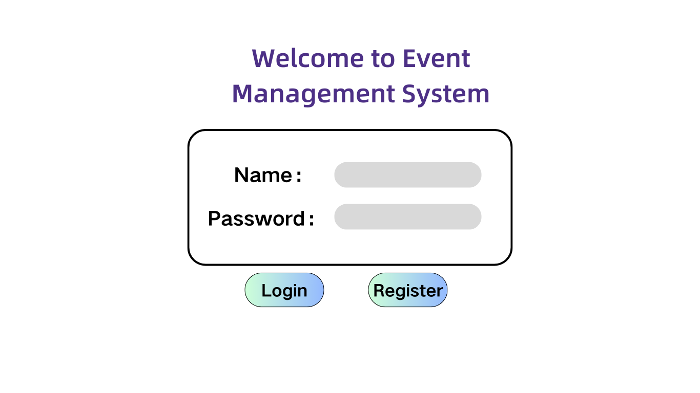
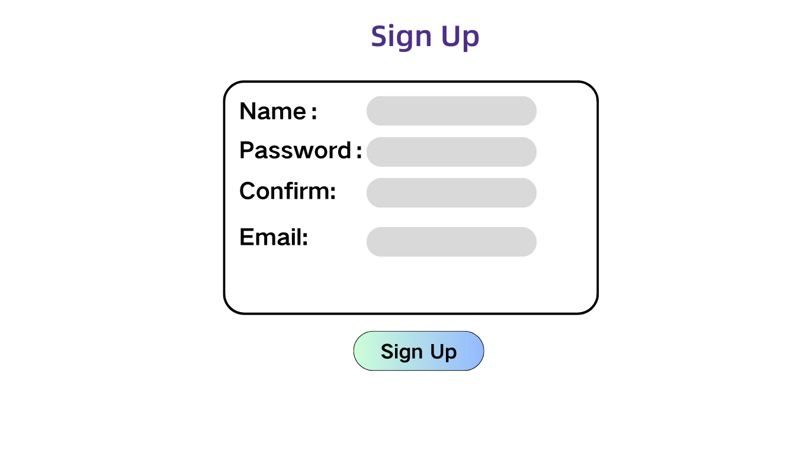
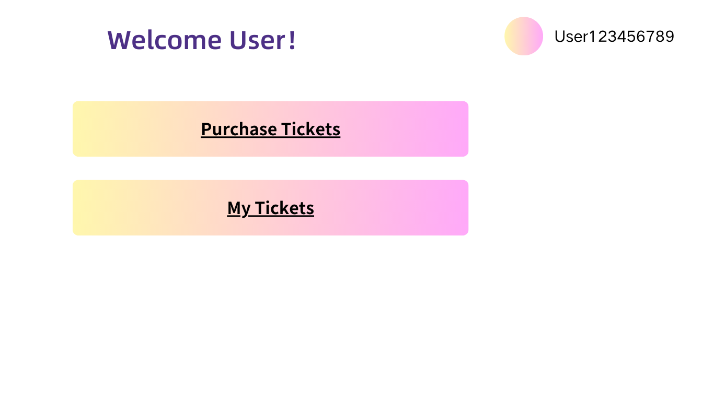
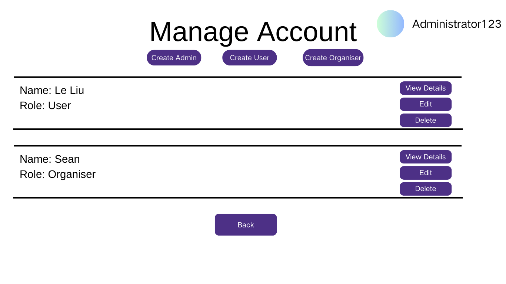
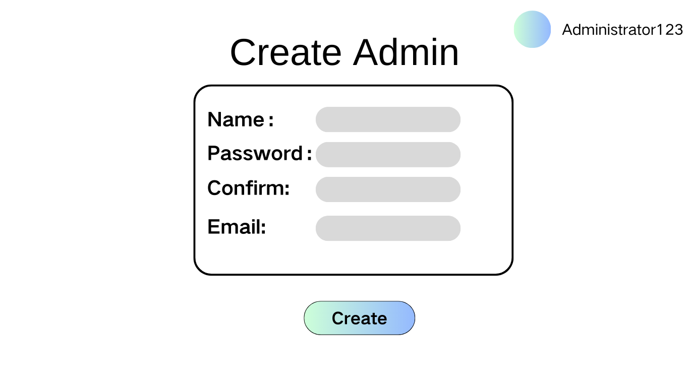
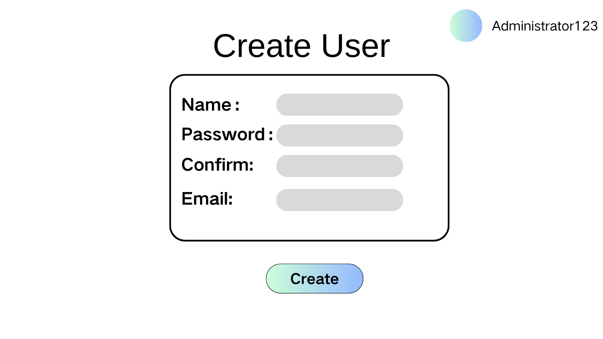
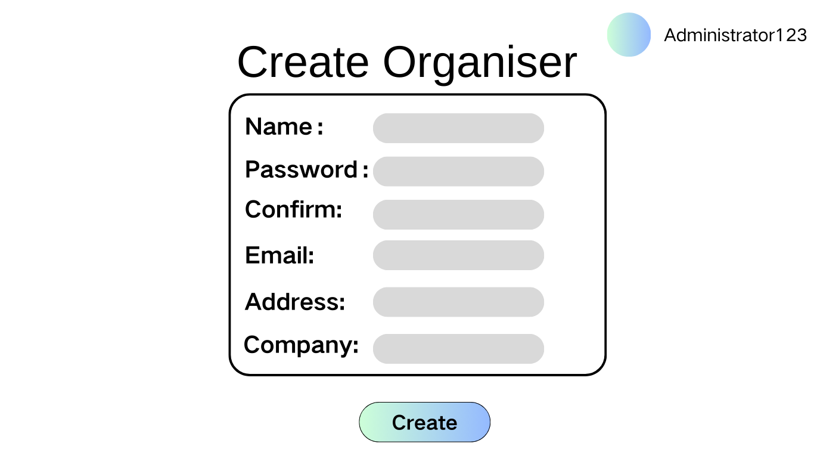

# Create Account

## Description

This use case includes the creation of a new account by. Administrator could create new User/Organiser/Administrator accounts. Users can register a new User account. This includes entering user details such as username, password, email, and other necessary information.

## Actors

- Administrator
- User

## Triggers

- The need to create a new account in the system

## Preconditions

- This is on the Admin Dashboard Page. **(Admin Dashboard Page)**.
- This is on the Register Page **(Login Page)**

## Postconditions

- For User: After the use case is completed, the new account will be created and stored in the system, and the user will be logged in and redirected to their dashboard.
- For Administrator: After the use case is completed, the new account will be created and stored in the system, and the administrator will be notified of the successful creation.

## Course of Events

### 01 - User Sign up
#### Basic Course of Event

1. The user clicks the "Sign Up" button on the login page. **(01 - Login Page)**
2. The system navigates to the account creation page. **(02 - Sign Up Page)**
3. The user enters the required account details (username, password, email, etc.) 
4. The system redirects the user to their dashboard **(03 - User Dashboard)**
#### Alternative Courses of Events - Account Already Exists
1. The user clicks the "Sign Up" button on the login page. **(01 - Login Page)**
2. The system navigates to the account creation page. **(02 - Sign Up Page)**
3. The user enters the required account details (username, password, email, etc.) 
4. The system displays an error message indicating that the account already exists

#### Related UI Prototypes

| Tile | Page |
| --- | --- |
| 01- Login Page |  |
| 02 - Sign Up Page |  |
| 03 - User Dashboard |  |

### 02  - Administrator Creates Account for User/Organizer/Admin

#### Basic Course of Events

1. The administrator select create account button(3 types). **(01 - Account Management Page)**
2. The system navigates to the account creation page.  **(02- CreateAdmin Page/ 03-CreateUser Page/ 04-CreateOrganizer Page)**
3. The administrator enters the required account details for the new user/Organizer/admin. 
4. The system renturn to account manage page.

#### Alternative Courses of Events - Account Already Exists
1. The administrator select create account button(3 types). **(06 - Account Management Page)**
2. The system navigates to the account creation page. **(02- CreateAdmin Page/ 03-CreateUser Page/ 04-CreateOrganizer Page)**
3. The administrator enters the required account details for the new user/Organizer/admin. 
4. The system displays an error message indicating that the account already exists. **(05- Create User exists)**
5. The administrator clicks OK
6. The system returns to the create account page. 

#### Related UI Prototypes

| 01 - Account Creation Page    |    
|---| 
|  | 

| 02 - CreateAdmin Page    |    
|---| 
|  | 

| 03-CreateUser Page|
|---|
| |

| 04-CreateOrganizer Page|
|---|
| |

| 05 - create User exists Page|
| --- |
||

## Inclusions
None

## Data Outcomes
**CREATE** - A new object will be added to the system representing the new account

**READ** - The details of the newly created account will be retrieved