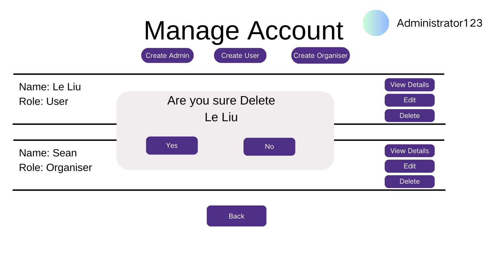

# Delete Account

## Description

This use case allows users and administrators to delete an existing account from the system. Users can delete their own accounts, while administrators can delete any user's account.

## Actors

- Administrator

## Triggers

This use case is triggered when administrator decides to delete an account.

## Preconditions

- The account to be deleted must exist in the system.
- The Administrator must be logged in to delete account.

## Postconditions

- The specified account is removed from the system.

## Courses of Events

### 01 - Basic Course of Events

#### Course of Events
1. The administrator navigates to the account management page **(01 - Account Management Page)**.
2. The administrator selects the user account to delete.
3. The system prompts for confirmation of the deletion. **(02- Deletion Confirmation)**
4. The administrator confirms the deletion.
5. The system deletes the account and notifies the administrator of the successful deletion.

#### Related UI Prototypes
|             01 - Account Management Page              |             02 - Deletion Confirmation             |
|:-----------------------------------------------------:|:--------------------------------------------------:|
|  |  |

