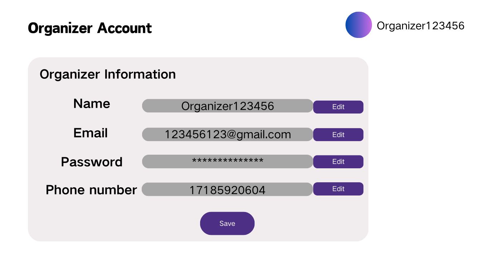
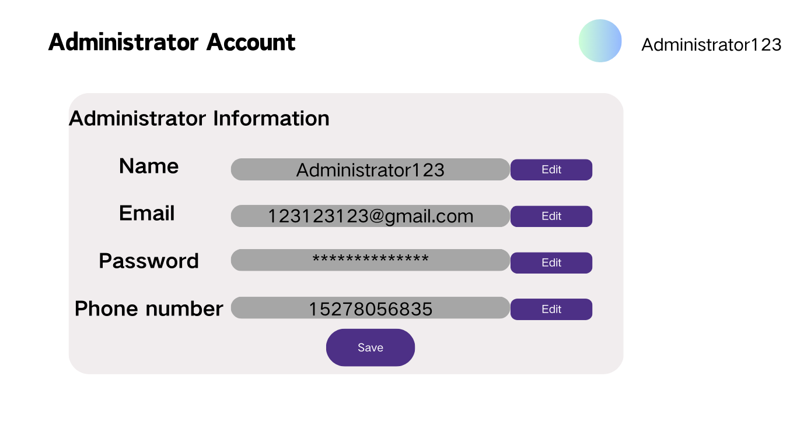

# Update Account

## Description

This use case allows users, organizer, and administrators to update the details of an existing account. User/Organizer can update their own information, while administrators can update any account information.

## Actors

- Administrator
- User
- Organizer

## Triggers

This use case is triggered when a user, organizer or administrator wants to change account details.

## Preconditions
- User/Organizer/Admin is log in.
- The account to be updated must exist in the system.

## Postconditions

- The updated account details are saved in the system.

## Courses of Events

### 01 - Basic Course of Events

#### Course of Events
1. The user navigates to the account settings page **(01 - Account Settings Page)**.
2. The user selects the option to update their account information.
3. The user enters the new details (username, password, email, etc.).
4. The system validates the entered details.
5. The system updates the account information and displays a success message.

#### Related UI Prototypes
|       01 - Account Settings Page        |
|:---------------------------------------:|
|   |
|  :-------------------------------------:  |
|    |
|  :-------------------------------------:  |
|  |

### 02 - Administrator Updates Another User's Account

#### Course of Events
1. The administrator navigates to the account management page **(01 - Account Management Page)**.
2. The administrator selects the user account to update.
3. The administrator enters the new details.
4. The system validates the entered details.
5. The system updates the account information and notifies the administrator of the successful update.

#### Related UI Prototypes
|             01 - Account Management Page              |
|:-----------------------------------------------------:|
|  |
