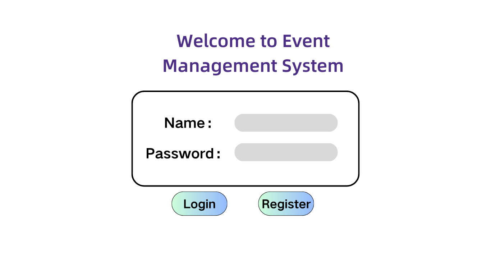
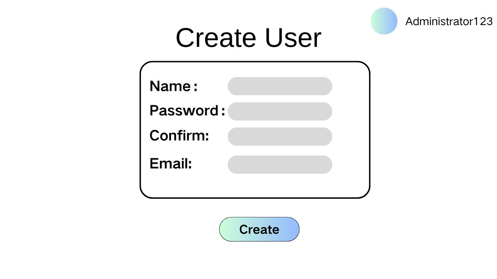
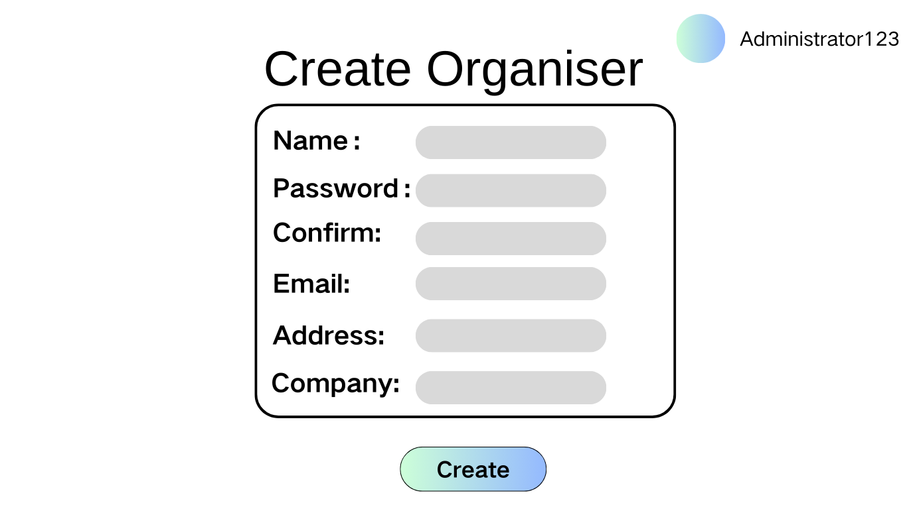

# Create Account

## Description

This use case includes the creation of a new account by. Administrator could create new User/Organiser/Administrator accounts. Users can register a new User account. This includes entering user details such as username, password, email, and other necessary information.

## Actors

- Administrator
- User

## Triggers

This use case is triggered by the following situations:

- The need to create a new account in the system

## Preconditions

- Admin is log in
- User wish to sign up

## Postconditions

- For User: After the use case is completed, the new account will be created and stored in the system, and the user will be logged in and redirected to their dashboard.
- For Administrator: After the use case is completed, the new account will be created and stored in the system, and the administrator will be notified of the successful creation.

## Course of Events

### 01 - User Sign up

#### Course of Events
1. The user, clicks the "Sign Up" button on the login page. **(01 - Login Page)**
2. The system navigates to the account creation page. **(02 - Sign Up Page)**
3. The user enters the required account details (username, password, email, etc.) 
4. The system validates the entered details
5. The system creates the new account and logs the user in
6. The system redirects the user to their dashboard **(03 - User Dashboard)**

#### Related UI Prototypes

| Tile | Page |
| --- | --- |
| 01- Login Page |  |
| 02 - Sign Up Page |  |
| 03 - User Dashboard |  |

### 02  - Administrator Creates Account for User/Organizer/Admin

#### Course of Events

1. The administrator select manage account button. **(05 - Admin Dash Page)**
2. The system navigates to the account creation page  **(01 - Account Management Page)**
3. The administrator choose the account type which he want to create.
4. The administrator enters the required account details for the new user/Organizer. **(02- CreateAdmin Page/ 03-CreateUser Page/ 04-CreateOrganizer Page)**
5. The system creates the new account
6. The system notifies the administrator that the account has been successfully created

#### Related UI Prototypes
| 05 - Admin Dash Page|
| --- |
||

| 01 - Account Creation Page    |    
|---| 
|  | 

| 02 - CreateAdmin Page    |    
|---| 
|  | 

| 03-CreateUser Page|
|---|
| |

| 04-CreateOrganizer Page|
|---|
| |

## Inclusions
Account Creation

## Data Outcomes
**CREATE** - A new object will be added to the system representing the new account

**READ** - The details of the newly created account will be retrieved