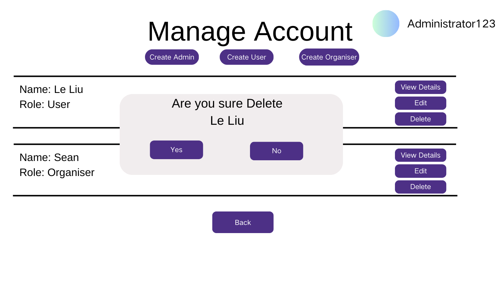

# Delete Account

## Description

This use case allows users and administrators to delete an existing account from the system. Users can delete their own accounts, while administrators can delete any user's account.

## Actors

- Administrator
- User

## Triggers

This use case is triggered when a user or administrator decides to delete an account.

## Preconditions

- The account to be deleted must exist in the system.
- The user must be logged in to delete their own account.

## Postconditions

- The specified account is removed from the system.

## Courses of Events

### 01 - Basic Course of Events

#### Course of Events
1. The user navigates to the account settings page **(01 - Account Settings Page)**.
2. The user selects the option to delete their account.
3. The system prompts the user to confirm the deletion.
4. The user confirms the deletion.
5. The system deletes the account and displays a success message.

#### Related UI Prototypes
|         01 - Account Settings Page         |
|:------------------------------------------:|
|  |

### 02 - Administrator Deletes Another User's Account

#### Course of Events
1. The administrator navigates to the account management page **(01 - Account Management Page)**.
2. The administrator selects the user account to delete.
3. The system prompts for confirmation of the deletion.
4. The administrator confirms the deletion.
5. The system deletes the account and notifies the administrator of the successful deletion.

#### Related UI Prototypes
| 01 - Account Management Page | 02 - Deletion Confirmation |
|:--:|:--:|
|  |  |

