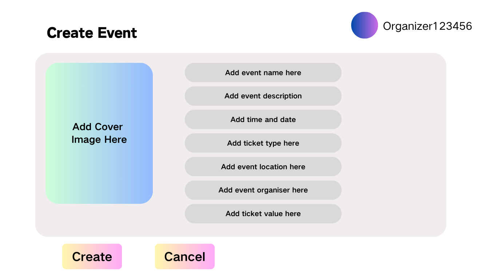

# Create Event

## Description

This use case includes the creation of a new event
This includes entering event name, description, date, time, venue, organiser and ticket information as necessary
(Details about tickets include the type, price, number available, and number sold for each type of ticket)

## Actors

- Administrators
- Organisers

## Triggers

The need to create a new event in the system

## Preconditions

The list events use case was executed

## Postconditions

- After the use case is completed, the new event will be created and stored in the system, and the events owned by this organiser will be displayed
- For administrator, after the use case is completed, the new event will be created and stored in the system, and all events will be displayed

## Course of Events

### 01 - Basic Course of Events

#### Course of Events
1. The organiser/administrator performs the list events use case **(01 - List Events Page - Organiser)** **(02 - List Events Page - Administrator)**
2. The organiser/administrator selects the create event functionality
3. The system displays a dialog to enter the event details **(05 - Create Event Dialog)**
4. The organiser/administrator enters the event details (name, description, date, time, venue, organiser  ticket information)
5. The system updates the view to show the current events for the specified organiser/administrator, including the newly made event **(01 - List Events Page - Organiser)** **(02 - List Events Page - Administrator)**

#### Related UI Prototypes
| 01 - List Events Page - Organiser                                | 02 - List Events Page - Administrator                                      | 05 - Create Event Dialog                      |
|------------------------------------------------------------------|----------------------------------------------------------------------------|-----------------------------------------------|
| .png) | .png) |  |

### 02  - Alternate Course of Events - Booking Clash

#### Course of Events

1. The organiser/administrator performs the list events use case **(01 - List Events Page - Organiser)** **(02 - List Events Page - Administrator)**
2. The organiser/administrator selects the create event functionality
3. The system displays a dialog to enter the event details **(05 - Create Event Dialog)**
4. The organiser/administrator enters the event details (name, description, date, time, venue, organiser  ticket information)
5. The system warns the organiser/administrator that this event if created would conflict with an existing event. The organiser is allowed to modify the details of the event and can continue the use case from step 4 of the basic course of events **(06 - Create Event Dialog - Time and Venue Clash)**

#### Related UI Prototypes
| 01 - List Events Page - Organiser                                | 02 - List Events Page - Administrator                                      | 05 - Create Event Dialog                      | 06 - Create Event Dialog - Time and Venue Clash                                        |
|------------------------------------------------------------------|----------------------------------------------------------------------------|-----------------------------------------------|----------------------------------------------------------------------------------------|
| .png) | .png) |  |  |

## Inclusions
List Events

## Data Outcomes
**CREATE** - A new object will be added to the system representing the new event

**READ** - The details of the all recorded events will be retrieved
