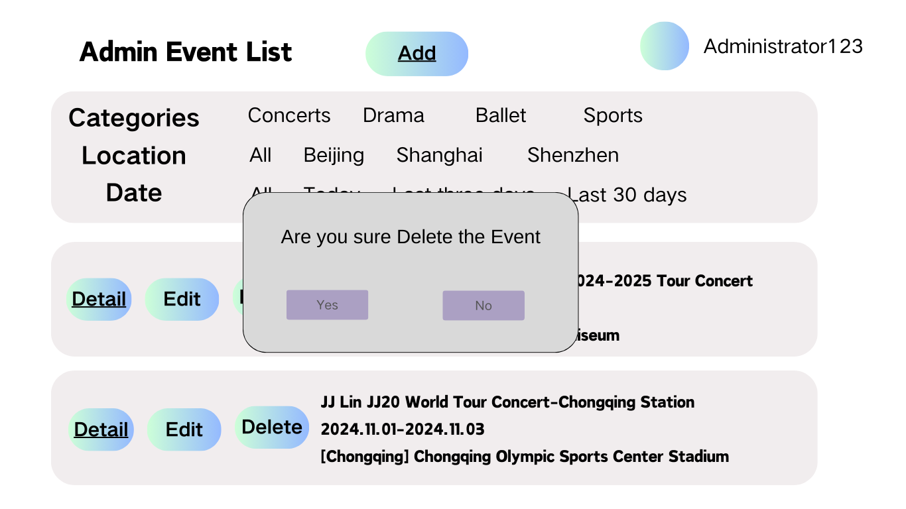

# Delete Events

## Description

This use case includes the process of removing an existing event from the system

## Actors

Administrators

## Triggers

The need to delete an event from the system

## Preconditions

- The list events use case was executed
- The event to be deleted exists in the system

## Postconditions

After the use case is completed, the event will be removed from the system

## Course of Events

### 01 - Basic Course of Events

#### Course of Events
1. The Administrator selects the remove events functionality of the event to be deleted **(02 - List Events Page - Administrator)**
2. The system asks the Administrator to confirm **(04 - Delete Events - Confirmation Dialog)**
3. The Administrator selects **Yes**
4. The system updates the display to show the current events, with the selected event removed **(02 - List Events Page - Administrator)**

#### Related UI Prototypes
| 02 - List Events Page - Administrator | 04 - Delete Events - Confirmation Dialog                      |
| --------------------------------------|---------------------------------------------------------------|
| .png) |  |

### 02 - Alternate course of events - Do Not Delete

#### Course of Events
1. The Administrator selects the remove events functionality of the event to be deleted **(02 - List Events Page - Administrator)**
2. The system asks the Administrator to confirm **(04 - Remove Events - Confirmation Dialog)**
3. The Administrator selects **No**
4. The system returns to the List Events page of the application **(02 - List Events Page - Administrator)**

#### Related UI Prototypes
| 02 - List Events Page - Administrator | 04 - Delete Events - Confirmation Dialog                      |
| ------------------------------------- |---------------------------------------------------------------|
| .png) |  |

## Inclusions
List Events

## Data Outcomes
**DELETE** - The system deletes the event from the database

**READ** - The details of the all events will be retrieved
