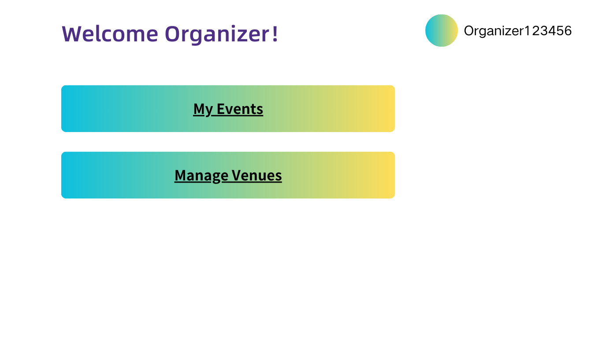
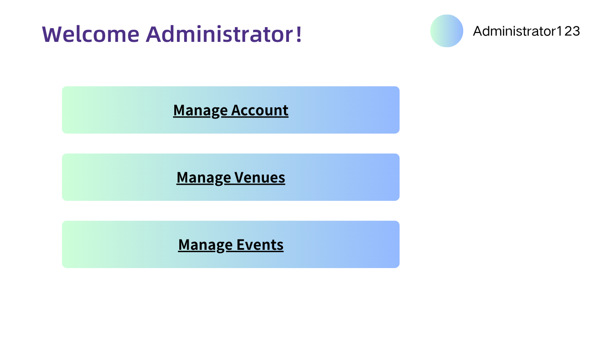

# List Events

## Description

This use case includes navigating the application to list the current events, with options to filter events based on category, date, and location

## Actors

Administrators
Organisers

## Triggers

This use case is triggered by the following situations:

- The need to view the list of currently recorded events
- The need to create a new event
- The need to delete recorded events
- The need to update recorded events

## Preconditions

The Administrator/Organiser has login its account

## Postconditions

- After the use case is completed, the organisers will see a list of their created events displayed on the screen
- After the use case is completed, the administrators will see a list of all created events displayed on the screen

## Course of Events

### 01 - Basic Course of Events

#### Course of Events
1. The organiser/administrator clicks the “My Events"/"Manage Events” button on the main page **(09 - Organiser Dashboard Page)**  **(10 - Admin Dashboard Page)**
2. The system displays a filter option at the top of the screen, allowing the user to filter events by category, date, or location **(01 - List Events Page - Organiser)** **(02 - List Events Page - Administrator)**
3. The organiser/administrator selects the desired filter options (category, date, or location) from the dropdown list or inputs the relevant criteria
4. The system displays the filtered list of events based on the selected criteria, including the event name, time, and venue

#### Related UI Prototypes
| 09 - Organiser Dashboard Page                                  | 10 - Admin Dashboard Page                                                    | 01 - List Events Page - Organiser | 02 - List Events Page - Administrator                                     |
|----------------------------------------------------------------|------------------------------------------------------------------------------|-----------------------------------|---------------------------------------------------------------------------|
|  |  |.png) | .png) |

## Inclusions
None

## Data Outcomes
**READ** - The system retrieves all events 
