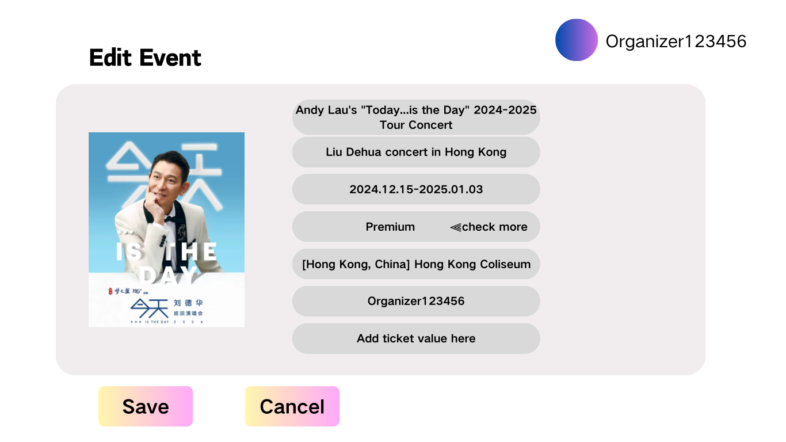
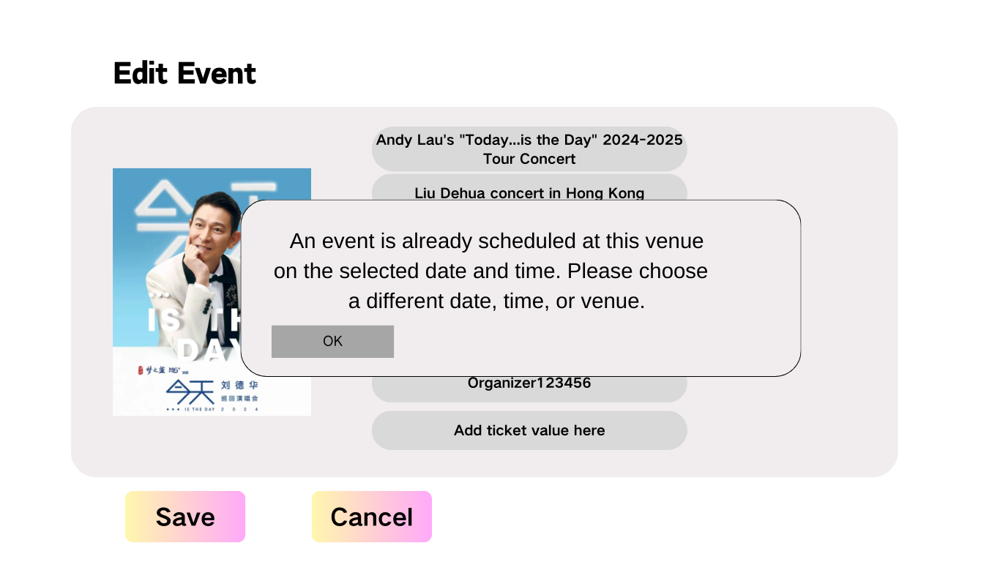

# Update Event

## Description

This use case includes the process of updating the details for an existing event

## Actors

Administrators
Organiser

## Triggers

The need to update some detail of the event previously made

## Preconditions

- The list events use case was executed
- The event to be changed must exist

## Postconditions:

- After the use case is completed, the event will be changed and stored in the system, and the events owned by this organiser will be displayed
- For administrator, after the use case is completed, the event will be changed and stored in the system, and all events will be displayed

## Courses of Events

### 01 - Basic course of events
#### Course of Events
1. The organiser/administrator selects the relevant event from the display to be updated **(01 - List Events Page - Organiser)** **(02 - List Events Page - Administrator)**
2. The system displays a dialog to enter the event details  **(07 - Update Event Page)**
3. The organiser/administrator updates the details of the event and clicks "Save"
4. The system updates the view to show the current events for the specified organiser/administrator, including the newly changed event **(01 - List Events Page - Organiser)** **(02 - List Events Page - Administrator)**
#### Related UI Prototypes
| 01 - List Events Page - Organiser                             | 02 - List Events Page - Administrator                                      | 07 - Update Event Page|
|---------------------------------------------------------------|----------------------------------------------------------------------------|-----------------------|
| .png) | .png) | |

### 02  - Alternate Course of Events - Booking Clash

#### Course of Events

1. The organiser/administrator selects the relevant event from the display to be updated **(01 - List Events Page - Organiser)** **(02 - List Events Page - Administrator)**
2. The system displays a dialog to enter the event details  **(07 - Update Event Page)**
3. The organiser/administrator updates the details of the event and clicks "Save"
4. The system warns the organiser/administrator that this event if created would conflict with an existing event. The organiser is allowed to modify the details of the event and can continue the use case from step 4 of the basic course of events  **(08 - Update Event Dialog - Time and Venue Clash)**

#### Related UI Prototypes
| 01 - List Events Page - Organiser                             | 02 - List Events Page - Administrator                                      | 07 - Update Event Page| 08 - Update Event Dialog - Time and Venue Clash                                        |
|---------------------------------------------------------------|----------------------------------------------------------------------------|-----------------------|----------------------------------------------------------------------------------------|
| .png) | .png) | |  |

### 03  - Alternate Course of Events - Do not update
#### Course of Events
1. The organiser/administrator selects the relevant event from the display to be updated **(01 - List Events Page - Organiser)** **(02 - List Events Page - Administrator)**
2. The system displays a dialog to enter the event details  **(07 - Update Event Page)**
3. The organiser/administrator updates the details of the event and clicks "Cancel"
4. The system returns to the List Events page of the application  **(01 - List Events Page - Organiser)** **(02 - List Events Page - Administrator)**
#### Related UI Prototypes
| 01 - List Events Page - Organiser                             | 02 - List Events Page - Administrator                                      | 07 - Update Event Page|
|---------------------------------------------------------------|----------------------------------------------------------------------------|-----------------------|
| .png) | .png) | |

## Inclusions

List Events

## Data Outcomes
**UPDATE** - Details of the selected event will be modified

**READ** - The details of the all events will be retrieved
