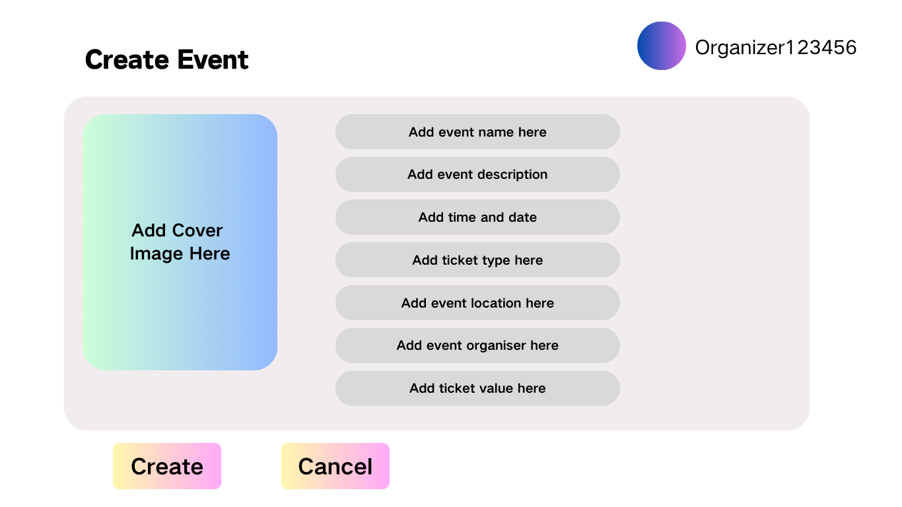

# List Events

## Description

This use case allows users (organizers and attendees) to view all upcoming events in the system.

## Actors

Organizers, Users

## Triggers

This use case is triggered when a user or organizer wishes to view upcoming events in the system.

## Preconditions

- Events must exist in the system.

## Postconditions

None

## Courses of Events

### 01 - Basic course of events
#### Course of Events
1. The user performs a request to display all events.
2. The system fetches a list of upcoming events from the database.
3. The user sees a display of events, including titles, dates, venues, and descriptions.
4. The user can filter, search, or sort events.
5. The system updates the display based on the filters or search terms provided by the user.

#### Related UI Prototypes
| 01 - Events List Page |
|:--:|
|  |

### 02 - Alternate course of events - No Events Available

#### Course of Events
1. The user performs a request to display all events.
2. The system detects that there are no upcoming events available.
3. The system informs the user that no events are found. The use case ends.

#### Related UI Prototypes
| 01 - No Events Page |
|:--:|
|  |

## Inclusions

Search Event, Filter Events

## Data Outcomes

**READ** - A list of upcoming events is retrieved.

---

---

# Create Event

## Description

This use case allows organizers to create a new event by entering relevant details, such as event name, date, venue, and ticket information.

## Actors

Organizers

## Triggers

This use case is triggered when an organizer initiates the process to create a new event.

## Preconditions

- The organizer must be logged in.

## Postconditions

A new event is created in the system.

## Courses of Events

### 01 - Basic course of events
#### Course of Events
1. The organizer navigates to the event creation page.
2. The system prompts the organizer to enter the event details (name, description, date, venue, ticket details).
3. The organizer completes the form and submits it.
4. The system validates the details and creates the event.
5. The system displays a confirmation message to the organizer.

#### Related UI Prototypes
| 03 - Create Event Page |
|:--:|
|  |

### 02 - Alternate course of events - Validation Failure

#### Course of Events
1. The organizer navigates to the event creation page.
2. The system prompts the organizer to enter the event details.
3. The organizer enters invalid or incomplete data.
4. The system displays error messages, and the use case ends.

#### Related UI Prototypes
| 03 - Error on Create Event Page |
|:--:|
|  |

## Inclusions

Validate Event Details

## Data Outcomes

**CREATE** - A new event is created in the database.

---

# Edit Event

## Description

This use case allows organizers to modify the details of an event they have previously created.

## Actors

Organizers

## Triggers

This use case is triggered when an organizer selects an event to edit.

## Preconditions

- The event must exist, and the organizer must have permission to edit it.

## Postconditions

The event details are updated in the system.

## Courses of Events

### 01 - Basic course of events
#### Course of Events
1. The organizer selects an event from their event list.
2. The system fetches the event details.
3. The organizer edits the event details (e.g., date, venue, ticket information).
4. The system updates the event and displays a confirmation message.

#### Related UI Prototypes
| 04 - Edit Event Page |
|:--:|
|  |

### 02 - Alternate course of events - Invalid Data

#### Course of Events
1. The organizer selects an event to edit.
2. The organizer provides invalid or incomplete data.
3. The system displays validation errors, and the event is not updated.

#### Related UI Prototypes
| 04 - Edit Event Error Page |
|:--:|
|  |

## Inclusions

Validate Event Details

## Data Outcomes

**UPDATE** - The event details are modified in the database.
