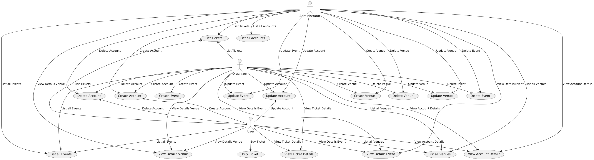
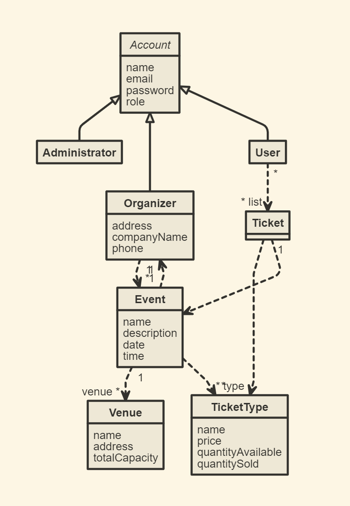

# Team Project: *Group 04*
#TODO:修改个人信息  依据本文档分工完成任务

DDL：10.18（周五）
中期点：本周四晚22：00至少完成1-2个用例图；本周四晚至少完成2个UI设计图。用于周五Lab Feedback
注：Push Commit使用简短的English。禁止无意义commit提交
## Team Members
| Number | Name          | Email(s)                           | CSGitLab Username |
|--------|---------------|------------------------------------|-----------------|
| TM1    | Le Liu        | le.liu1@ucdconnect.ie              | @Mrle |
| TM2    | Ziheng Wang   | ziheng.wang1@ucdconnect.ie         | @zihengWang                |     
| TM3    | Team Member 3 | tm3@ucdconnect.ie, personal@qq.com |@22201003        |     
| TM4    | Team Member 4 | tm4@ucdconnect.ie                  | @22201004       |     
| TM5    | Team Member 5 | tm5@ucdconnect.ie                  | @22201005       |     
| TM6    | Team Member 6 | tm6@ucdconnect.ie                  | @22201006       |     
| TM7    | Team Member 7 | tm7@ucdconnect.ie                  | @22201007       |     

# Requirements Analysis

This is the requirements analysis for the Event application, this application is good for administrator, User, Organiser.

## Use Case Descriptions

This includes the following use cases:
### Login
1. [Log in]()
### Account Management
1. [Create Account](01-requirements/Account/createAccount.md)
2. [Delete Account](02-name.md)
3. [Updata Account](03-name.md)
4. [View Details Account](04-name.md)
5. [List Accounts](05-name.md)

### Event Management
1. [Create Event]()
2. [Delete Event]()
3. [Update Event]()
4. [View Details Account]()
5. [List Events]()

### Venue Management
1. [Create Venue]()
2. [Delete Venue]()
3. [Update Venue]()
4. [View Details Venue]()
5. [List Venue]()

### Ticket Management
1. [Buy Ticket]()
2. [View Details Ticket]()
3. [List Tickets]()
4. [List Upcoming Tickets]()

## Use Case Diagram

The use cases are shown in this diagram

## Domain Model

## System Glossary

| Term        | Description                                                  |
| ----------- | ------------------------------------------------------------ |
| Event       | A scheduled concert or performance.                          |
| Organiser   | The individual or entity responsible for planning and managing the event.|
| administrator| A person responsible for managing the system, including user accounts, events, and overall system settings.|
|  User       | A person who uses the system to purchase tickets.|
| Venue       | The location where the event takes place|
| Ticket      | A document or digital pass that grants entry to an event.|
| Schedule    | The timetable of events, including dates and times.|
| Ticket Type | The category of a ticket, such as VIP, General Admission, or Early Bird.|
| Price       | The cost of a ticket for an event.|
| Availability| The number of tickets available for sale.|
| Sold        | The number of tickets that have been sold.|
| Event Details| Information about an event, including name, description, date, time, venue, and organiser.|
| Purchase    | The action of buying a ticket for an event.|
| Login       | The process of authenticating a user to access the system.|
| Registration| The process of creating a new user account.|
| Dashboard   | The main interface where users can access different functionalities of the system.|

## UI Prototypes/Sketches
### Login Page

                                        

## Milestone 1 Requirements Analysis

### Distribution of work on this milestone
#### Overall Distribution of Work
| Team Member | TM1 | TM2 | TM3 | TM4 | TM5 | TM6 | TM7 |
|-------------|-----|-----|-----|-----|-----|-----|-----|
| Percentage  | 12% | 12% | 12% | 12% | 12% | 12% | 12% |
#### Task Allocation
| Item               | Primary Author | Contributor | Contributor | Reviewer |
|--------------------|-|--|--|--|
| Use Case Diagram   |LL | ZH |  |  |
| Domain Model       |ZH |  |  | LL |
| System Golssary    |ZH |  |  |  |
| UI Prototypes      |SC |ZH  |  |  |
| Use Case 1: "Create Account" |LL |  |  |  |
| Use Case 2: "Delete Account" |XY|YX|
| Use Case 3: "Update Account" |XY |YX |  |  |
| Use Case 4: "View details Account" |XY |YX  |  |  |
| Use Case 5: "List all Accouts"|XY|YX|
| Use Case 6: "Create Venue"|YX| XY|   |   |
| Use Case 7: "Delete Venue"|YX|XY|
| Use Case 8: "Update Venue"|YX|XY|   |   |
| Use Case 9: "List all Venues" |XY |YX  |  |  |
| Use Case 10: "View Details Venue" |XY  |YX  |  |  |
| Use Case 11: "Create Event"|YH|BH|    |   |
| Use Case 12: "Delete Event|YH|
| Use Case 13: "Update Event"|YH|BH|  |   |
| Use Case 14: "View Details Event"|YH|BH|  |   |
| Use Case 15: "List all Events"|YH|BH|  |   |
| Use Case 16: "Create(Buy) Ticket"|YH|BH|  |   |
| Use Case 17: "View Details Ticket|BH|YH|  |   |
| USe Case 18: "My Tickets"|BH|YH|   |   |

#### Reflection Statements
| Team Member | Contribution Reflection Statement |
|-------------|-------------------|
|TM1| <*Required*: The percentage data is unlikely to tell the whole story about your contribution. Write a brief statement explaining and reflecting on your contribution to this phase of the project.> |
|TM2| <*Required*: The percentage data is unlikely to tell the whole story about your contribution. Write a brief statement explaining and reflecting on your contribution to this phase of the project.> |
|TM3| <*Required*: The percentage data is unlikely to tell the whole story about your contribution. Write a brief statement explaining and reflecting on your contribution to this phase of the project.> |
|TM4| <*Required*: The percentage data is unlikely to tell the whole story about your contribution. Write a brief statement explaining and reflecting on your contribution to this phase of the project.> |
|TM5| <*Required*: The percentage data is unlikely to tell the whole story about your contribution. Write a brief statement explaining and reflecting on your contribution to this phase of the project.> |
|TM6| <*Required*: The percentage data is unlikely to tell the whole story about your contribution. Write a brief statement explaining and reflecting on your contribution to this phase of the project.> |
|TM7| <*Required*: The percentage data is unlikely to tell the whole story about your contribution. Write a brief statement explaining and reflecting on your contribution to this phase of the project.> |
|TM8| <*Required*: The percentage data is unlikely to tell the whole story about your contribution. Write a brief statement explaining and reflecting on your contribution to this phase of the project.> |

