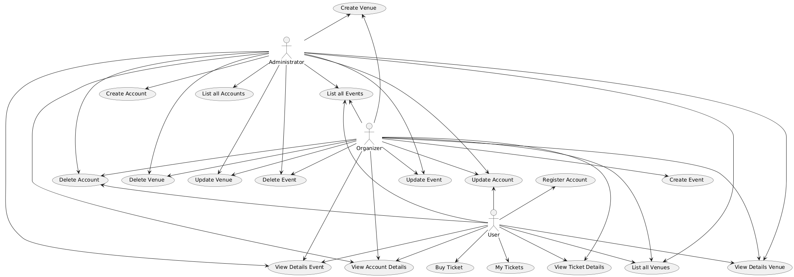

# Team Project: *Group 04*
#TODO:修改个人信息  依据本文档分工完成任务

DDL：10.18（周五）
中期点：本周四晚22：00至少完成1-2个用例图；本周四晚至少完成2个UI设计图。用于周五Lab Feedback
注：Push Commit使用简短的English。禁止无意义commit提交
## Team Members
| Number | Name          | Email(s)                           | CSGitLab Username |
|--------|---------------|------------------------------------|-----------------|
| TM1    | Le Liu        | le.liu1@ucdconnect.ie              | @Mrle |
| TM2    | Ziheng Wang   | ziheng.wang1@ucdconnect.ie         | @zihengWang                |     
| TM3    | Team Member 3 | tm3@ucdconnect.ie, personal@qq.com |@22201003        |     
| TM4    | Team Member 4 | tm4@ucdconnect.ie                  | @22201004       |     
| TM5    | Team Member 5 | tm5@ucdconnect.ie                  | @22201005       |     
| TM6    | Team Member 6 | tm6@ucdconnect.ie                  | @22201006       |     
| TM7    | Team Member 7 | tm7@ucdconnect.ie                  | @22201007       |     

# Requirements Analysis

This is the requirements analysis or business modelling for the Event application.

## Use Case Descriptions

This includes the following use cases:

1. [Use Case 1](01-name.md)
2. [Use Case 2](02-name.md)
3. [Use Case 3](03-name.md)
4. [Use Case 4](04-name.md)
5. [Use Case 5](05-name.md)

## Use Case Diagram

The use cases are shown in this diagram

## Domain Model

## System Glossary

| Term        | Description                                                  |
| ----------- | ------------------------------------------------------------ |
| Term 1      | Description of term 1                                        |

## UI Prototypes/Sketches
| Page Name   | Image                                                  |
| ----------- | ------------------------------------------------------------ |
| Name/description of page      |                                         |

## Milestone 1 Requirements Analysis

### Distribution of work on this milestone
#### Overall Distribution of Work
| Team Member | TM1 | TM2 | TM3 | TM4 | TM5 | TM6 | TM7 |
|-------------|-----|-----|-----|-----|-----|-----|-----|
| Percentage  | 12% | 12% | 12% | 12% | 12% | 12% | 12% |
#### Task Allocation
| Item               | Primary Author | Contributor | Contributor | Reviewer |
|--------------------|-|--|--|--|
| Use Case Diagram   |LL |  |  |  |
| Domain Model       |ZH |  |  |  |
| System Golssary    |ZH |  |  |  |
| UI Prototypes      |SC |ZH  |  |  |
| Use Case 1: "Create Account" |YX |XY  |  |  |
| Use Case 2: "Modift Account" |YX |XY  |  |  |
| Use Case 3: "View Account" |XY |YX  |  |  |
| Use Case 4: "List Venues" |XY |YX  |  |  |
| Use Case 5: "View Venue Details" |XY  |YX  |  |  |
| Use Case 6: "Add New Venue"|YX| XY|   |   |
| Use Case 7: "Edit Venue"|YX|XY|   |   |
| Use Case 8: "List Events"|YH|BH|  |   |
| Use Case 9: "View Events Details"|YH|BH|  |   |
| Use Case 10: "Create Event"|YH|BH|    |   |
| Use Case 11: "Edit Event"|YH|BH|  |   |
| Use Case 12: "Buy Ticket"|YH|BH|  |   |
| USe Case 13: "List Upcoming Tickets"|BH|YH|   |   |
| Use Case 14: "List Puchased Tickets"|BH|YH|   |   |
| Use Case 15: "View Ticket Details|BH|YH|  |   |
| Use Case 16: "Refund/Reschedule Ticket"|BH|YH|    |   |

#### Reflection Statements
| Team Member | Contribution Reflection Statement |
|-------------|-------------------|
|TM1| <*Required*: The percentage data is unlikely to tell the whole story about your contribution. Write a brief statement explaining and reflecting on your contribution to this phase of the project.> |
|TM2| <*Required*: The percentage data is unlikely to tell the whole story about your contribution. Write a brief statement explaining and reflecting on your contribution to this phase of the project.> |
|TM3| <*Required*: The percentage data is unlikely to tell the whole story about your contribution. Write a brief statement explaining and reflecting on your contribution to this phase of the project.> |
|TM4| <*Required*: The percentage data is unlikely to tell the whole story about your contribution. Write a brief statement explaining and reflecting on your contribution to this phase of the project.> |
|TM5| <*Required*: The percentage data is unlikely to tell the whole story about your contribution. Write a brief statement explaining and reflecting on your contribution to this phase of the project.> |
|TM6| <*Required*: The percentage data is unlikely to tell the whole story about your contribution. Write a brief statement explaining and reflecting on your contribution to this phase of the project.> |
|TM7| <*Required*: The percentage data is unlikely to tell the whole story about your contribution. Write a brief statement explaining and reflecting on your contribution to this phase of the project.> |
|TM8| <*Required*: The percentage data is unlikely to tell the whole story about your contribution. Write a brief statement explaining and reflecting on your contribution to this phase of the project.> |

