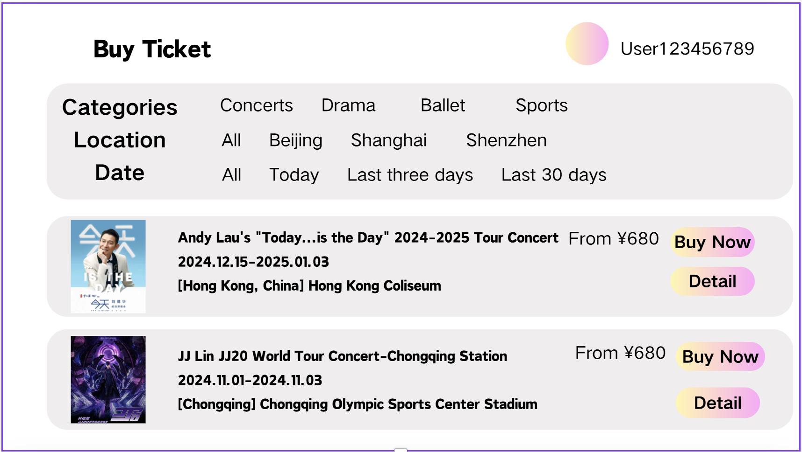

# Team Project: *Group 04*

## Team Members
| Number | Name         | Email(s)                   | CSGitLab Username |
|--------|--------------|----------------------------|-------------------|
| TM1    | Le Liu       | le.liu1@ucdconnect.ie      | @Mrle             |
| TM2    | Ziheng Wang  | ziheng.wang1@ucdconnect.ie | @zihengWang       |     
| TM3    | Yunhan Gao   | yunhan.gao@ucdconnect.ie   | @YunhanGao        |     
| TM4    | Bohan Zhang  | bohan.zhang@ucdconnect.ie  | @BohanZhang       |     
| TM5    | Sicheng Yi   | sicheng.yi@ucdconnect.ie   | @Prestine         |     
| TM6    | Xinya Shi    | xinya.shi@ucdconnect.ie    | @Shirley          |     
| TM7    | Yuxuan Zhang | yuxuan.zhang@ucdconnect.ie | @WhiteCamellia    |     

# Requirements Analysis

This is the requirements analysis for the Event application, this application is good for administrator, User, Organiser.

## Use Case Diagram

The use cases are shown in this diagram

## Domain Model

## Use Case Descriptions

This includes the following use cases:
### Login
1. [Log in]()
### Account Management
1. [Create Account](Account/createAccount.md)
2. [Delete Account](Account/DeleteAccount.md)
3. [Updata Account](Account/UpdateAccount.md)
4. [View Details Account](Account/ViewAccountDetails.md)
5. [List Accounts](Account/ListAccounts.md)

### Event Management
1. [Create Event](Event/CreateEvent.md)
2. [Delete Event](Event/DeleteEvent.md)
3. [Update Event](Event/UpdateEvent.md)
4. [View Details Event](Event/ViewDetailsEvent.md)
5. [List Events](Event/ListEvents.md)

### Venue Management
1. [Create Venue](Venue/1.CreateVenue.md)
2. [Delete Venue](Venue/3.DeleteVenue.md)
3. [Update Venue](Venue/5.UpdateVenue.md)
4. [View Details Venue](Venue/4.ViewDetailsVenue.md)
5. [List Venue](Venue/2.ListVenues.md)

### Ticket Management
1. [Create(Buy) Ticket](Ticket/Create(Buy)Ticket.md)
2. [View Details Ticket](Ticket/ViewTicketDetails.md)
3. [My Tickets](Ticket/MyTickets.md)

## System Glossary

| Term        | Description                                                  |
| ----------- | ------------------------------------------------------------ |
| Event       | A scheduled concert or performance.                          |
| Organiser   | The individual or entity responsible for planning and managing the event.|
| administrator| A person responsible for managing the system, including user accounts, events, and overall system settings.|
|  User       | A person who uses the system to purchase tickets.|
| Venue       | The location where the event takes place|
| Ticket      | A document or digital pass that grants entry to an event.|
| Schedule    | The timetable of events, including dates and times.|
| Ticket Type | The category of a ticket, such as VIP, General Admission, or Early Bird.|
| Price       | The cost of a ticket for an event.|
| Availability| The number of tickets available for sale.|
| Sold        | The number of tickets that have been sold.|
| Event Details| Information about an event, including name, description, date, time, venue, and organiser.|
| Purchase    | The action of buying a ticket for an event.|
| Login       | The process of authenticating a user to access the system.|
| Registration| The process of creating a new user account.|
| Dashboard   | The main interface where users can access different functionalities of the system.|

## UI Prototypes/Sketches
### Login Page
| Login Page|
| --- |
||

### User Register

### Admin Main Page

### Organizer Main Page

### User Main Page

### Admin create new User

### Admin manage Account

### Venue List(Admin)

### Venuew List(Organiser)

### Create Venue

### Edit Venue

### Event List(Admin)
.png)
### Founded Events(Organiser)
.png)
### Event Details

### Create Event

### Edit Event

### Buy Ticket

### My Tickets

### Ticket Details

## Milestone 1 Requirements Analysis

### Distribution of work on this milestone
#### Overall Distribution of Work
| Team Member | TM1 (Leliu) | TM2 (ZihengWang) | TM3 (YunhanGao) | TM4 (BohanZhang) | TM5 (SichengYi) | TM6 (XinyaShi) | TM7 (YuxuanZhang) |
|-------------|-------------|------------------|-----------------|------------------|-----------------|----------------|-------------------|
| Percentage  | 12%         | 12%              | 12%             | 12%              | 12%             | 12%            | 12%               |
#### Task Allocation
| Item               | Primary Author | Contributor | Contributor | Reviewer |
|--------------------|----------------|-------------|--|--|
| Use Case Diagram   | LeLiu          | ZihengWang  |  |  |
| Domain Model       | ZihengWang     |             |  | LeLiu |
| System Golssary    | ZihengWang     |             |  |LeLiu|
| UI Prototypes      | SichengYi      | ZihengWang          |  |LeLiu|
| Use Case 1: "Create Account" | LeLiu          |             |  |  |
| Use Case 2: "Delete Account" | YunhanGao      | BohanZhang          |  |LeLiu|
| Use Case 3: "Update Account" | YunhanGao      | BohanZhang          |  |LeLiu|
| Use Case 4: "View details Account" | YunhanGao      | BohanZhang          |  |LeLiu|
| Use Case 5: "List all Accouts"| YunhanGao      | BohanZhang          |   |  LeLiu |
| Use Case 6: "Create Venue"| XinyaShi       | YuxuanZhang          |   |   |
| Use Case 7: "Delete Venue"| XinyaShi       | YuxuanZhang          |
| Use Case 8: "Update Venue"| XinyaShi       | YuxuanZhang          |   |   |
| Use Case 9: "List all Venues" | XinyaShi       | YuxuanZhang          |  |  |
| Use Case 10: "View Details Venue" | XinyaShi       | YuxuanZhang          |  |  |
| Use Case 11: "Create Event"| YuxuanZhang    | XinyaShi          |    |   |
| Use Case 12: "Delete Event| YuxuanZhang    |XinyaShi|   |    |
| Use Case 13: "Update Event"| YuxuanZhang    | XinyaShi          |  |   |
| Use Case 14: "View Details Event"| YuxuanZhang    | XinyaShi          |  |   |
| Use Case 15: "List all Events"| YuxuanZhang    | XinyaShi          |  |   |
| Use Case 16: "Create(Buy) Ticket"| BohanZhang     | YunhanGao          |  |   |
| Use Case 17: "View Details Ticket| BohanZhang             | YunhanGao          |  |   |
| USe Case 18: "My Tickets"| BohanZhang             | YunhanGao          |   |   |

