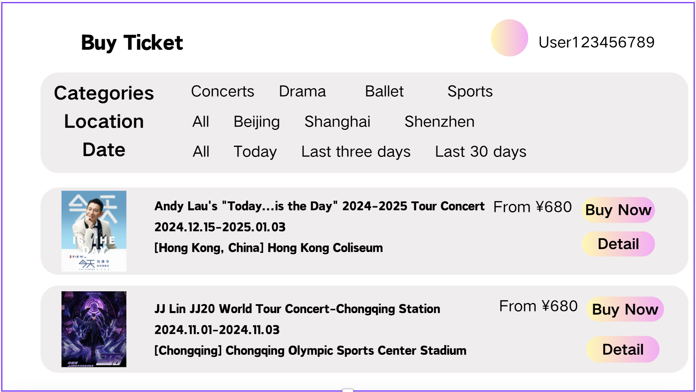

### Buy Ticket

**Use Case Name:** Buy Ticket

**Primary Actor:** User

**Brief Description:** This use case involves allowing a user to purchase a ticket for an event. Users can browse available events, select an event, choose a ticket type, and proceed with the purchase. The system processes the purchase and updates the ticket availability accordingly.

**Actors:**
- User

**Triggers:**
- The user wishes to purchase a ticket for an event.

**Preconditions:**
- The user must be logged in to the system.
- The selected event must have tickets available for purchase.

**Postconditions:**
- The system confirms the purchase and provides the user with a ticket.
- The system updates the availability of tickets for the selected event.

**Courses of Events**

### 01 - Basic course of events
#### Course of Events
1. User navigates to the "Purchase Ticket" section of the application. **(UserDashBoard page)**
2. User browses available events and selects an event they wish to attend.
3. The ticket types and availability for the selected event are displayed to the user.
4. User selects the desired ticket type and quantity.
5. User proceeds to the payment section.
6. After payment is completed, a confirmation is displayed, and the purchased ticket is added to the "My Tickets" section.

#### Related UI Prototypes
| 01 - Main Page |
| --- |
|  |

| 02 - UserDashboard |
| --- |
| 

### 02 - Alternate course of events - No Tickets Available
#### Course of Events
1. User navigates to the "Purchase Ticket" section of the application. **(UserDashBoard page)**
2. User browses available events and selects an event they wish to attend.
3. If no tickets are available, a message is displayed indicating that the event is sold out.

#### Related UI Prototypes

**Special Requirements:**
- The system should display all available ticket types and quantities clearly.

**Inclusions:**
- Select Event
- Choose Ticket Type
- Payment Processing

**Data Outcomes**
**READ** - The system retrieves the details of the selected event and available tickets.
**UPDATE** - The ticket availability is updated after a successful purchase.
**CREATE** - A new ticket record is created and added to the user's account.

**Primary Actor's Goal:** To purchase a ticket for an event and receive confirmation of the purchase.