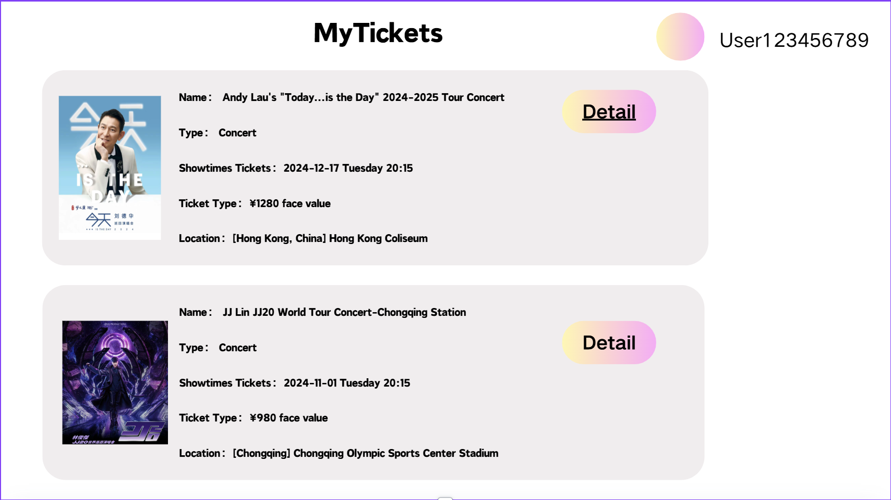

# My Tickets

**Use Case Name:** My Tickets

**Primary Actor:** User

**Brief Description:** This use case involves displaying all tickets that a user has purchased, including both past and upcoming events. Users can view details such as event name, date, time, venue, and ticket type, and can filter tickets based on different criteria for easier management.

**Actors:**
- User

**Triggers:**
- The user wishes to view their purchased tickets.
- The user navigates to the "My Tickets" section of the application.

**Preconditions:**
- The user must be logged in to the system.
- The user must have purchased at least one ticket for an event.

**Postconditions:**
- The system displays a list of all purchased tickets by the user, including relevant event details.

**Courses of Events**

### 01 - Basic course of events
#### Course of Events
1. User navigates to the "My Tickets" section of the application. **(UserDashBoard page)**
2. The system displays a list of purchased tickets **(My Tickets Page)**
3. User can view tickets, venue, date, or ticket status (e.g., past or upcoming).

#### Related UI Prototypes
| 01 - My Tickets Page |
| --- |
| |

| 02 - UserDashboard |
| --- |
| |

### 02 - Alternate course of events - No Purchased Tickets
#### Course of Events
1. User navigates to the "My Tickets" section of the application. **(UserDashBoard page)**
3. If no tickets are found, the system displays a message indicating that there are no purchased tickets.

**Inclusions:**
- Display Purchased Tickets
- Filter Tickets

**Data Outcomes**
**READ** - The details of all purchased tickets for the user will be retrieved.
**FILTER** - The list of tickets can be filtered by the user to show only specific categories.

**Primary Actor's Goal:** To view and manage all events for which the user has purchased tickets, including both past and upcoming events.