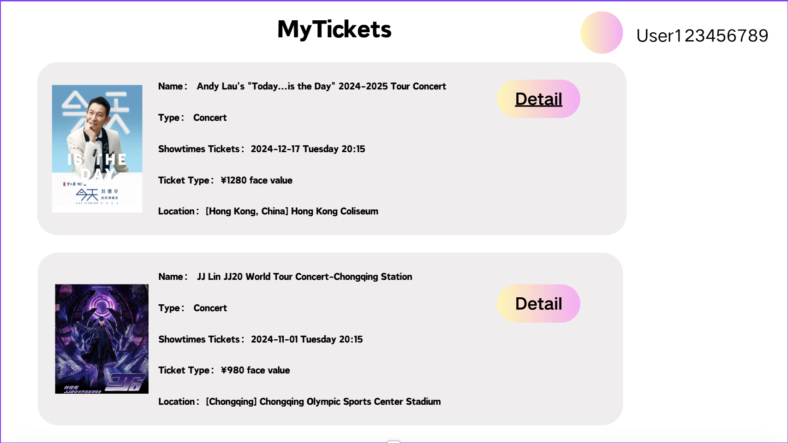

### View Ticket Details

**Use Case Name:** View Ticket Details

**Primary Actor:** User

**Brief Description:** This use case involves displaying the detailed information of a specific ticket that a user has purchased. The details include event name, date, time, venue, ticket type, seat number (if applicable), and price. Users can access these details by selecting a specific ticket from their purchased tickets list.

**Actors:**
- User

**Triggers:**
- The user wishes to view the details of a purchased ticket.
- The user selects a specific ticket from the "My Tickets" section of the application.

**Preconditions:**
- The user must be logged in to the system.
- The user must have purchased at least one ticket for an event.

**Postconditions:**
- The system displays detailed information for the selected ticket.

**Courses of Events**

### 01 - Basic course of events
#### Course of Events
1. User selects a specific ticket from the list of purchased tickets.**(My Tickets Page)**
2. The system displays the ticket details, including event name, date, time, venue, ticket type, seat number (if applicable), and price.**(Tickets Datail Page)**

#### Related UI Prototypes
| 01 - My Tickets Page |
| --- |
| |

| 02 - UserDashboard |
| --- |
| |

| 03 - Tickets Details Page|
| --- |
| |

### 02 - Alternate course of events - No Details Available
#### Course of Events
1. User navigates to the "My Tickets" section of the application.
2. User selects a specific ticket from the list of purchased tickets.
3. If no details are available (e.g., due to an error), the system displays a message indicating that the ticket details are currently unavailable.

**Inclusions:**
- Display Ticket Details

**Data Outcomes**
**READ** - The details of the selected ticket will be retrieved.

**Primary Actor's Goal:** To view the detailed information of a specific ticket they have purchased, including all relevant event and seat details.

