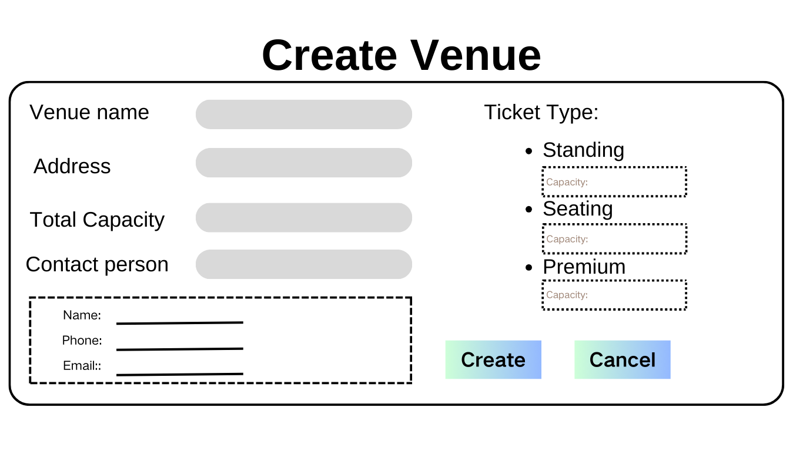

# Create Venue

## Description

The organizer/ administrator can use the venue management feature to create a new venue to the system. The details of the new venue will be entered and saved in the system for future use and management.

## Actor

- Organizer
- Administrator

## Trigger 

This use case is triggered by the following situations:

- The organizer/administrator selects the "Create" option from the venue management page.

## Precondition
It's an organizer/administrator is logged into the system and select "Manage Venues" button.

## Postcondition
None

## Course of Events

### 01- Basic course of events

#### Course of events

1. The organizer/administrator selects the **"Create"** button from the venue management page. **(01- Manage Venue Page)**
2. The system prompts the organizer to enter the venue details. **(02 -Create Venue Page)**
3. The organizer/administrator fills in all the required information and submits.
4. The system validates the input to ensure it is complete and correct.
5. The organizer/administrator select: **"Confirm"**
6. The system saves the new venue information to the database and  confirms the venue has been successfully added and displays a confirmation message. **(01- Manage Venue Page)**

#### Related UI Prototypes

| 01 - Manage Venue Page                               |
|------------------------------------------------------|
|  |
|      |

| 02 - Create Venue Page                      |
|---------------------------------------------|
|  |

## Inclusions

None

## Data Outcomes

**CREATE** -  A new venue will be added to the system. The system will save the venue's details.

**READ** - The details of the venue that user selected.