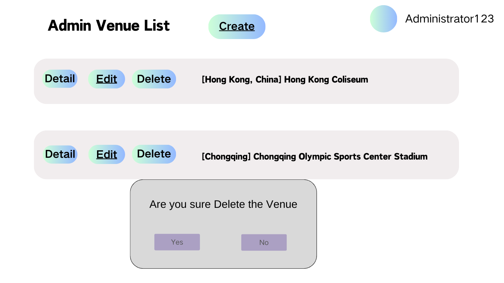

# Delete Venue

## Description

The administrator can use the venue management feature to delete an existing venue from the system.

## Actors

Administrator

## Trigger

This use case is triggered by the following situations:

- Administrator get in to the venue management page and select the "Delete" button 

## Precondition

It's an administrator is logged into the system and select "Delete" button.

The venue to be cancelled must exist

## Postcondition

None

## Courses of Events

### 01 - Basic course of events

#### Course of Events

1. The administrator performs the venue management page and  **(01 - Manage Venue Page)**
2. The administrator selects the relevant venue delete 
3. The system asks the user to confirm **(01 - Manage Venue Page)**
4. The administrator selects **"Yes"**
5. The system updates the display to show the existing venues **(01 - Manage Venue Page)**

### 02 - Alternate course of events - Do Not Delete

#### Course of Events

1. The administrator performs the venue management page and  **(01 - Manage Venue Page)**
2. The administrator selects the relevant venue delete
3. The system asks the user to confirm **(01 - Manage Venue Page)**
4. The administrator selects **"No"**
5. The system updates the display to show the existing venues **(01 - Manage Venue Page)**

#### Related UI Prototypes

| 01 - Manage Venue Page                               |
|------------------------------------------------------|
|  |
|      |

| 02 - Delete Venue Page                               |
|------------------------------------------------------|
|           |

## Inclusions

None

## Data Outcomes

**DELETE** - The selected venue will be removed
