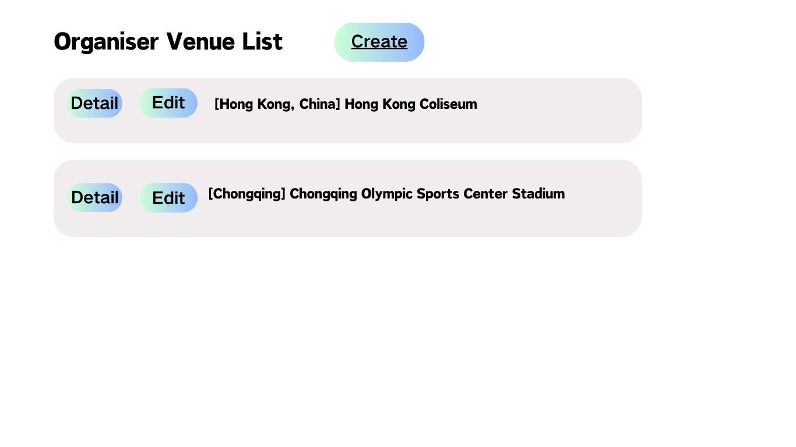

# View Venue Details

## **Description:** 

This use case allows the user to view detailed information about a specific venue. The user selects a venue from the list of existing venues, and the system displays the details. The user can review these details to help make decisions related to venue management. 

## **Actors:**  

Organizer, Administrator

## Trigger

This use case is triggered by the following situations:

- Organizers/Administrator want to view the details of the relevant venue

## Preconditions 
The organizer or administrator is logged into the system.

## Postconditions 

None

## Course of Events

### 01- Basic course of events

#### Course of events

1. The user selects **"Detail"** on specific venue from the list of existing venues **(01 -Manage Venue Page)**
2. The system displays the venue details to the user **(02 -Venue Detail Page)**
3. The user reviews the venue details.

#### Related UI Prototypes

| 01 - Manage Venue Page                               |
|------------------------------------------------------|
|  |
|      |

| 02 - Venue Detail Page             |
|------------------------------------|
|  |

## Inclusions
None

## Data Outcomes

**READ** - Allow organizer/administrator change data of venue