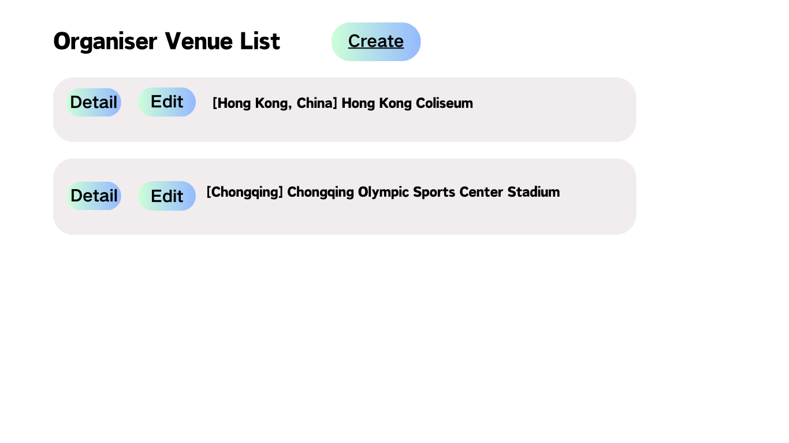
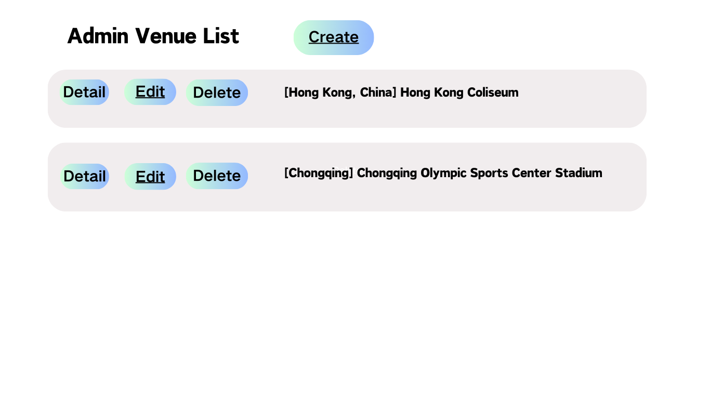
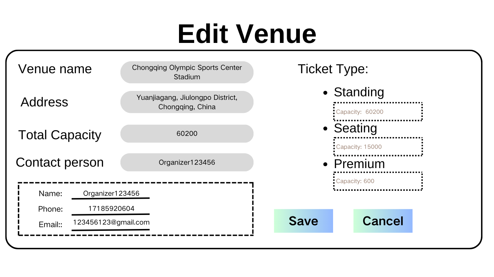

# Update Venue

## Description

This use case allows organizer/administrator to modify the details of an existing venue. The organizer/administrator can select a venue and edit its name, address, capacity, available facilities, and other information. Once the edits are complete, the system saves and updates the venue details, ensuring that the latest information is available for users to view and use.

## Actors

Organizer, Administrator

## Triggers

This use case is triggered by the following situations:

- Organizer/Administrator clicks on the "Edit" button next to the selected venue from the list of existing venues.

## Precondition

The venue to be changed must exist

## Postcondition

None

## Courses of Events

### 01 - Basic course of events

#### Course of Events

1. The organizer/administrator selects **"Edit"** on the venue from the list of existing venues to edit. **(01- Manage Venue Page)**
2. The system displays the current details of the selected venue. **(02- Edit Venue Page)**
3. The organizer/administrator modifies the venue's information. 
4. The organizer/administrator saves the edited information. 
5. The system validates the input data and saves the changes. 
6. The system confirms the success of the modifications and displays the updated venue details.

| 01 - Manage Venue Page                               |
|------------------------------------------------------|
|  |
|      |

| 02 - Edit Venue Page                    |
|-----------------------------------------|
|  |

## Inclusions

None

## Data Outcomes

**Save** - Details of the selected venue will be modified

**Cancel** - The details of the venue for the current date will be retrieved