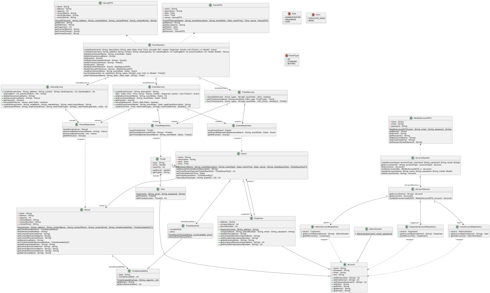

# Team Project: *Group XX*

## Team Members
| Number | Name         | Email(s)                   | CSGitLab Username |
|--------|--------------|----------------------------|-------------------|
| TM1    | Le Liu       | le.liu1@ucdconnect.ie      | @Mrle             |
| TM2    | Ziheng Wang  | ziheng.wang1@ucdconnect.ie | @zihengWang       |     
| TM3    | Yunhan Gao   | yunhan.gao@ucdconnect.ie   | @YunhanGao        |     
| TM4    | Bohan Zhang  | bohan.zhang@ucdconnect.ie  | @BohanZhang       |     
| TM5    | Sicheng Yi   | sicheng.yi@ucdconnect.ie   | @Prestine         |     
| TM6    | Xinya Shi    | xinya.shi@ucdconnect.ie    | @Shirley          |     
| TM7    | Yuxuan Zhang | yuxuan.zhang@ucdconnect.ie | @WhiteCamellia    |

# Design

This phase continues the development process by performing further realisations on the courses of events that we described in the analysis phase. This requires the creation of new sequence diagrams for each course of events. These diagrams will be more detailed in that they will contain all parameter and type infromation. Additionally, the diagrams will now include the UI and database components of the system.

Decisions made while constructing these diagrams are also documented in the class diagram.

## Use Case Realisations (Sequence Diagrams)

Each use case contains the separate sequence diagrams for each course of events. The diagrams are stored in the `images` folder and referenced in the markdown files.

### Account Management
1. [Create Account](/03-design/usecases/docs/01-create-account)
2. [Delete Account]()
3. [Updata Account]()
4. [View Details Account]()
5. [List Accounts]()

### Event Management
6. [Create Event]()
7. [Delete Event]()
8. [Update Event]()
9. [View Details Event]()
10. [List Events]()

### Venue Management
11. [Create Venue]()
12. [Delete Venue]()
13. [Update Venue]()
14. [View Details Venue]()
15. [List Venue]()

### Ticket Management
16. [Create(Buy) Ticket]()
17. [View Details Ticket]()
18. [My Tickets]()

## Class Diagram

The class diagram represents the information gained about the system by completing the use case realisations. 

## Data Persistence
Within the Event Management System the following classes should be maintained between executions.
1. User - id, name, password, email, role
2. Administrator - id, name, password, email, role
3. Organiser - id, name, password, email, role, address, companyName, PhoneNumber
4. Ticket - id, type, price, quantity
5. Event - id, name, discription, date, time
6. Venue - id, name, address, capacity, contactName, contactPhone, contactEmail
7. TicketQuantity - id, type, price, numberSold, numberAvailable

### Relationships
1. User - Ticket (1 to many)
2. Event - Venue (many to 1）
3. Event - Ticket (1 to 1)
4. Organiser - Event (many to 1)
5. Event - TicketQuantity (1 to many)
6. Venue - TicketAvailability (1 to many)

## Milestone 3 Design

### Distribution of work on this milestone
#### Overall Distribution of Work

| Team Member | TM1 | TM2 | TM3 | TM4 | TM5 | TM6 | TM7 |
|-------------|-----|-----|-----|-----|-----|-----|-----|
| Percentage  | 15% | 15% | 14% | 14% | 14% | 14% | 14% |

#### Task Allocation
| Item               | Primary Author | Contributor | Contributor | Reviewer |
|--------------------|-----|-----|-----|-----|
| Data Persistence   |Sicheng | Ziheng |     |  |
| Class Diagram      |ZihengWang  |     |     |  LeLiu   |
| Create "..."       | Le  |
| Retrieved "..."    | Xinya|
| Update "..."       | Yunhan |
| Delete "..."       | Yuxuan|
| List "..."         | Bohan |
| Summary Repeated   |   ｜

#### Reflection Statements
| Team Member | Contribution Reflection Statement |
|-------------|-------------------|
|TM1| <*Required*: The percentage data is unlikely to tell the whole story about your contribution. Write a brief statement explaining and reflecting on your contribution to this phase of the project.> |
|TM2| <*Required*: The percentage data is unlikely to tell the whole story about your contribution. Write a brief statement explaining and reflecting on your contribution to this phase of the project.> |
|TM3| <*Required*: The percentage data is unlikely to tell the whole story about your contribution. Write a brief statement explaining and reflecting on your contribution to this phase of the project.> |
|TM4| <*Required*: The percentage data is unlikely to tell the whole story about your contribution. Write a brief statement explaining and reflecting on your contribution to this phase of the project.> |
|TM5| <*Required*: The percentage data is unlikely to tell the whole story about your contribution. Write a brief statement explaining and reflecting on your contribution to this phase of the project.> |
|TM6| <*Required*: The percentage data is unlikely to tell the whole story about your contribution. Write a brief statement explaining and reflecting on your contribution to this phase of the project.> |
|TM7| <*Required*: The percentage data is unlikely to tell the whole story about your contribution. Write a brief statement explaining and reflecting on your contribution to this phase of the project.> |
|TM8| <*Required*: The percentage data is unlikely to tell the whole story about your contribution. Write a brief statement explaining and reflecting on your contribution to this phase of the project.> |

